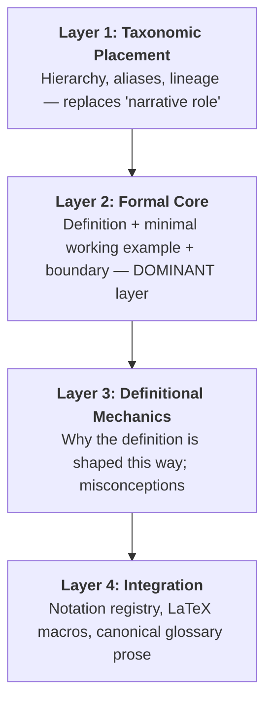

[[Research Writing VCU]]
[pplx](https://www.perplexity.ai/search/f738b615-9467-487d-b68b-0923bfee2c98?preview=1)

# Concept-Level Scaffolding Framework (Companion to Paper Ingestion)

> [!ABSTRACT] Purpose
> This is the **concept-level sibling** of `paper_ingestion_scaffolding_guide.md`. It uses the same 4-layer folding logic (context → formal core → insight → integration) but with content appropriate to **individual mathematical/statistical concepts** rather than whole papers. Save new concept notes as `nn-sdr/docs/key_terms_<ConceptName>.md` — matching the `[[key_terms_<ShortName>]]` cross-references already stubbed in Layer 2 of the paper scaffold.

---

## 🏗️ Why Concepts Need a Different Fold

A paper is an **authored artifact with a narrative arc**; a concept is a **reusable cognitive object**. Same skeleton, different weights:



| Layer | vs. Paper Scaffold | Adjustment |
| :--- | :--- | :--- |
| **L1** | ⚠️ Shrinks | No "role in the review" — instead, **position in the concept taxonomy** and which papers introduced/use it |
| **L2** | ✅ Dominant | "Population target + objective" becomes **formal definition + minimal working example + boundary** |
| **L3** | ✅ Reframed | "Why does the *method* work" → "**why is this definition shaped this way**" (each clause ↔ requirement it enforces) |
| **L4** | ⚠️ Reweighted | Paper-prose snippets → **reusable LaTeX macros, notation registry, glossary prose** pulled by many paper notes |

---

### Layer 1: Taxonomic Placement
*Purpose: Locate the concept in the knowledge hierarchy before touching the definition.*

- **Aliases & Synonyms**: All names/symbols in the literature (e.g., CMS = central mean subspace = central regression subspace).
- **Hierarchy**:
  - *Generalizes*: what this concept extends (CMS → CS under homoskedastic variance)
  - *Specializes*: what it narrows
  - *Sibling notions*: adjacent concepts with confusion risk (central subspace, central $\sigma$-field, central class)
- **Lineage**: First formalization (author, year) + cross-ref to `[[paper_obs_<ShortName>]]`.

### Layer 2: Formal Core (Dominant Layer)
*Purpose: The note lives or dies here. Definition alone is not folding — pair it with a concept image.*

- **Formal Definition**: Exact mathematical statement, with all quantifiers.
- **Minimal Working Example**: One concrete instance (e.g., $\mathbb{E}(Y \mid \mathbf{X}) = (\boldsymbol\beta^\top\mathbf{X})^2$ with $p=3$, $d=1$).
- **Boundary / What It Is NOT**: Failure cases and non-coverage (e.g., CMS $\neq$ CS under heteroskedastic variance).

### Layer 3: Definitional Mechanics
*Purpose: Explain why the definition is shaped this way — the concept-level analog of "mechanistic insight."*

- **Clause ↔ Requirement Mapping**: Each clause of the definition ↔ the requirement it enforces.
- **Equivalent Reformulations**: Population, operator-theoretic, and sample versions side by side.
- **Common Misconceptions**: Confusions with adjacent notions; typical misuse in the literature.

### Layer 4: Integration
*Purpose: Reusable assets consumed by paper notes and the manuscript.*

- **Notation Registry**: Standard symbol + LaTeX macro definition.
  ```latex
  \newcommand{\CMS}{\mathcal{S}_{\mathbb{E}(Y \mid \mathbf{X})}}
  ```
- **Canonical Glossary Prose**: One gold-standard sentence for the review's background section — impersonal, mechanism-focused voice (same Voice Check as the paper scaffold).
- **Used By**: Backlinks to every `[[paper_obs_<ShortName>]]` whose Layer 2 depends on this concept.

---

## 📋 Markdown Template for New Concept Notes

```markdown
# Concept: <Name>

**Aliases**: [...] | **Status**: [draft | stable] | **Type**: [threshold | routine]
**Prerequisites**: [[key_terms_...]] | **Used by**: [[paper_obs_...]]

## 1. Taxonomic Placement
- **Generalizes**: [...] | **Specializes**: [...] | **Siblings**: [...]
- **First formalized**: Author (Year) in [[paper_obs_<ShortName>]]

## 2. Formal Core
- **Definition**: [exact statement]
- **Minimal working example**: [one concrete instance]
- **Boundary**: [what the concept does NOT capture]

## 3. Definitional Mechanics
- **Clause ↔ requirement**: [why each clause exists]
- **Equivalent reformulations**: [population | operator | sample]
- **Common misconceptions**: [...]

## 4. Integration
### Notation
```latex
% \newcommand{...}
```
### Canonical Glossary Prose
> One reusable sentence, impersonal voice.
```

---

## 🚦 Status & Fading Protocol (APOS-based)

Concept understanding matures through **Action → Process → Object → Schema** stages. Track this explicitly:

- **`status: draft`** — Action/Process level: ingested from a single paper; you can *compute* with it but not yet *reason about* it as an object.
- **`status: stable`** — Object/Schema level: promoted only after the concept has been used **as a reified object in comparisons across ≥ 2 papers** (e.g., you can state how NN-SDR and MAVE target the CMS differently).
- **Fading rule**: once `stable`, Layers 2–3 may stay permanently collapsed in review contexts — scaffolding is withdrawn, mirroring the fold hierarchy (L1 visible, deeper layers on demand).

**Threshold vs. routine tagging**: Tag concept notes as `threshold` or `routine`. Threshold concepts (troublesome, transformative, integrative — e.g., the passage from matrix eigendecomposition to RKHS operator formulations) receive the full 4-layer treatment. Routine concepts get a lightweight two-section card (Formal Core + Integration only).

---

## 🔗 Linking Protocol (Concept ↔ Paper)

Bidirectional linking turns the vault into a Novakian concept map (general concepts up, specific down):

- **Paper → Concept**: every `paper_obs_*.md` Layer 2 "Prerequisite Key Terms" field links **down** to concept notes.
- **Concept → Paper**: every concept note's "Used By" field links **up** to the papers that depend on it.
- **Concept → Concept**: "Prerequisites / Generalizes / Siblings" links form the horizontal and vertical structure.

---

## 📚 Pedagogical Grounding

| Framework | Citation | Design Consequence |
| :--- | :--- | :--- |
| **Concept mapping / meaningful learning** | Novak & Cañas (2008); Ausubel | Explicit `Prerequisites / Generalizes / Used by` links; learners build the map, not just consume it |
| **Threshold concepts** | Meyer & Land (2003, 2005) | `threshold` vs `routine` tagging; full vs. lightweight treatment |
| **Concept image vs. concept definition** | Tall & Vinner (1981) | Every definition paired with minimal working example + "what it is NOT" boundary |
| **APOS theory** | Dubinsky (1991); Arnon et al. (2014) | `status: draft → stable` maturity marker; reification across ≥2 papers |
| **Cognitive load theory** | Sweller | Definition + example + notation in ONE note — avoid split attention |
| **Scaffolding & fading** | Wood, Bruner & Ross (1976); Bakker et al. (2015) | Fold levels withdraw support: L1 visible, deeper layers collapse as status → stable |

---

## 💡 Example Application: Central Mean Subspace

> [!NOTE] Concept: Central Mean Subspace
> **Aliases**: CMS, central regression subspace | **Status**: stable | **Type**: threshold
> **Prerequisites**: [[key_terms_ConditionalExpectation]], [[key_terms_CentralSubspace]]
> **Used by**: [[paper_obs_NN-SDR]], [[paper_obs_MAVE]], [[paper_obs_GMDDNet]]
>
> **Definition**: $\mathcal{S}_{\mathbb{E}(Y \mid \mathbf{X})} = \operatorname{span}\{\boldsymbol\beta : \mathbb{E}(Y \mid \mathbf{X}) \perp\!\!\!\perp \mathbf{X} \mid \boldsymbol\beta^\top\mathbf{X}\}$ — the minimal subspace capturing the conditional mean.
>
> **Minimal working example**: $\mathbb{E}(Y \mid \mathbf{X}) = (\boldsymbol\beta^\top\mathbf{X})^2$, $p=3$, $d=1$ — the CMS is $\operatorname{span}\{\boldsymbol\beta\}$ regardless of how $\operatorname{Var}(Y \mid \mathbf{X})$ depends on $\mathbf{X}$.
>
> **Boundary**: CMS $\neq$ CS when variance is heteroskedastic; the CMS may be a proper subspace of the CS.
>
> **Definitional mechanics**: conditioning on $\boldsymbol\beta^\top\mathbf{X}$ enforces mean-sufficiency only — this is precisely what permits $O(n)$-scale estimation methods to target the CMS without recovering the full CS.
>
> **Notation**: `\newcommand{\CMS}{\mathcal{S}_{\mathbb{E}(Y \mid \mathbf{X})}}`
