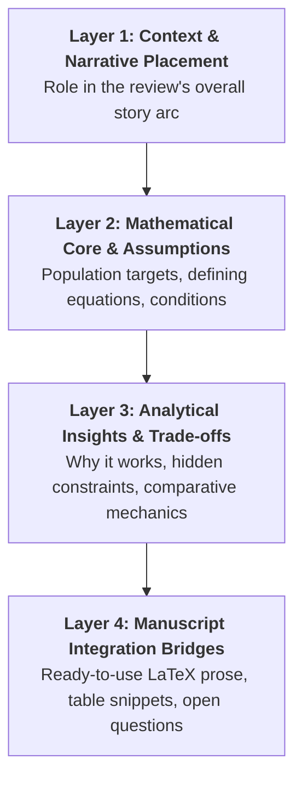

[[Research Writing VCU]] [[concept_scaffolding_guide]]
# Academic Paper Observation Scaffolding Framework

This scaffolding framework is designed for analyzing mathematical and statistical research papers. It bridges the gap between **raw technical extraction** (equations, theorems, algorithms) and **narrative synthesis** (how the paper's insights contribute to a broader review paper or working draft).

---

## 🏗️ The 4-Layer Observation Scaffolding

When reviewing a paper for inclusion in a review manuscript, structure your analysis into these four distinct layers:



---

### Layer 1: Context & Narrative Placement
*Purpose: Establish the paper's role in the review manuscript's broader storyline before diving into equations.*

- **Paper Details**: Title, Authors, Year, Venue/ArXiv ID, Local PDF path (`ref/`).
- **Narrative Role in the Review**: What function does this paper serve in your manuscript?
  - *Options*: [Foundational Baseline | Architectural Milestone | Theoretical Validation | Computational Solver | Cautionary Boundary | Unifying Framework]
- **The "Core Problem" Shift**: What specific limitation of prior work did this paper address? (e.g., *Replaces $O(n^3)$ Gram matrix inversion with an $O(n)$ gradient-based neural bottleneck.*)

---

### Layer 2: Mathematical Core & Assumptions
*Purpose: Precision extraction of population targets, defining equations, and mathematical boundaries.*

- **Population Target**:
  - Linear Subspace: Central Subspace $\mathcal{S}_{Y \mid \mathbf{X}}$ or Central Mean Subspace $\mathcal{S}_{\mathbb{E}(Y \mid \mathbf{X})}$
  - Non-Euclidean / Functional: Central $\sigma$-field $\mathcal{G}_{Y \mid \mathbf{X}}$, Central Class $\mathfrak{S}_{Y \mid \mathbf{X}}$, or RKHS Operator Range
- **Defining Objective / Operator**:
  \[
  \text{State the exact loss, discrepancy, likelihood, or variational bound.}
  \]
- **Domain of Validity & Assumptions**:
  - *Distributional*: Linearity condition, constant conditional variance, sub-exponential responses.
  - *Regularity*: Hölder continuity, bounded predictor support $[-B_x, B_x]^p$, compact manifolds.
- **Prerequisite Key Terms**: Cross-reference to `[[key_terms_<ShortName>]]`.

---

### Layer 3: Analytical Synthesis & Human Voice Insights
*Purpose: Move past "what the authors did" to explain the underlying mechanics, trade-offs, and comparative positioning.*

> [!TIP]
> **Voice Check**: Write from an **impersonal, mechanism-focused perspective**. Avoid author narration ("Kapla embarked on a journey") and evaluative fluff ("groundbreaking", "innovative"). Focus on **why the mechanics succeed or fail**.

1. **Mechanistic Insight**: *Why does this method achieve its result?*
   - *Example*: Rank regularization $W_1 = W_{11}W_{12}$ forces gradient descent to compress features through a $d$-dimensional subspace, implicitly spanning the CMS without needing a two-stage initialization.
2. **Hidden Constraints & Trade-offs**: *What are the unstated friction points?*
   - *Example*: Sensitivity to hyperparameter $d$; non-identifiability under overparameterization; loss of determinism due to stochastic noise.
3. **Comparative Positioning**: *How does this compare to adjacent methods in the taxonomy?*
   - *Contrast Matrix*:
     | Dimension | Method A (e.g., MAVE) | This Paper (e.g., NN-SDR) |
     | :--- | :--- | :--- |
     | **Estimator Class** | Local linear kernel smoother | Deep MLP bottleneck |
     | **Computational Complexity** | $O(n^2)$ smoothing evaluations | $O(n)$ minibatch SGD per epoch |
     | **Target** | CMS $\mathcal{S}_{\mathbb{E}(Y \mid \mathbf{X})}$ | CMS $\mathcal{S}_{\mathbb{E}(Y \mid \mathbf{X})}$ |

---

### Layer 4: Manuscript Integration Bridges
*Purpose: Produce ready-to-use prose and table entries for direct insertion into `manuscript/sdr_v*.tex`.*

#### 1. LaTeX Review Prose Snippet (Gold-Standard Voice)
```latex
% Ready-to-copy LaTeX paragraph for Section 3 of manuscript
\paragraph{MethodName \citep{citationKey}.}
MethodName formulates [target] by optimizing [objective] under [assumptions]. 
Unlike [prior method], which relies on [mechanism], MethodName achieves [property] through [architectural primitive]. 
However, [limitation/unresolved boundary condition].
```

#### 2. Summary Table Snippet
```latex
\textbf{ShortName} \citep{citationKey}: Brief architectural description 
& Target Object 
& Objective Function / Loss 
& Core Assumptions 
& Trade-offs / Limitations \\
```

#### 3. Open Questions & Future Research Prompts
- How does this result inform the open directions discussed in Section 4 of our manuscript?

---

## 📋 Markdown Template for New Paper Notes

Save new paper extractions in `nn-sdr/docs/paper_obs_<ShortName>.md` using this template:

```markdown
# Paper Observations: [<Paper Title>]

**Citation**: [[<BibTeX Key>]] | **PDF**: [Title Author Year.pdf](file:///path/to/ref/...) | **Key Terms**: [[key_terms_<ShortName>]]

## 1. Narrative Placement
- **Role in Review**: [Foundational | Milestone | Solver | Boundary]
- **Core Shift**: [1-2 sentences describing what problem this paper addresses]

## 2. Mathematical Core
- **Target**: $\mathcal{S}_{Y \mid \mathbf{X}}$ / $\mathcal{S}_{\mathbb{E}(Y \mid \mathbf{X})}$ / $\mathcal{G}_{Y \mid \mathbf{X}}$
- **Defining Objective**:
  \[
  \text{Objective equation}
  \]
- **Key Assumptions**: [List 2-4 core mathematical conditions]

## 3. Mechanistic Insights & Trade-offs
- **Why it works**: [Mechanistic explanation]
- **Hidden Trade-offs**: [Computational, identifiability, or hyperparameter constraints]
- **Comparison to Adjacent Work**: [Contrast with prior/concurrent papers]

## 4. Manuscript Integration
### LaTeX Prose Block
```latex
% Copy-pasteable manuscript text
```

### Table Snippet
```latex
% Copy-pasteable table row
```
```

---

## 💡 Example Application: GKDR (Fukumizu & Leng 2014)

Here is how the scaffolding looks when populated for a classic paper:

> [!NOTE]
> **Role in Review**: *Nonlinear Kernel Baseline / Transition from Matrix to Operator SDR*
> 
> **Mathematical Target**: Central Class $\mathfrak{S}_{Y \mid \mathbf{X}}$ via RKHS Cross-Covariance Operators $\Sigma_{\mathbf{X}\mathbf{X}}^{-1} \Sigma_{\mathbf{X}Y}$.
>
> **Mechanistic Insight**: GKDR replaces matrix eigendecompositions of inverse means with gradient-based minimization of kernel cross-covariance operators on the Grassmann manifold $\operatorname{Gr}(d, p)$. This bypasses the linearity and constant variance conditions of classical SIR, but introduces $O(n^3)$ Gram matrix scaling that modern neural SDR methods (e.g., GMDDNet, BENN) aim to circumvent through stochastic optimization.
